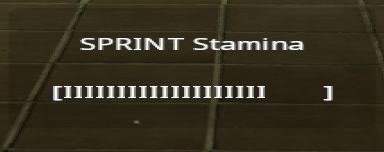

# Pro Sprint

## Overview

A modified version of [Greyscale's sprint plugin](https://forums.alliedmods.net/showthread.php?p=567905) that adds a stamina bar and some natives to modify a player's stamina.

I have only tested this in Counter-Strike Source but should work in CSGO.

## Natives

Other plugins can set a players stamina using the following natives:

- `void ProSprint_SetPlayerStamina(int client, float stamina, float duration)`: set the maximum amount of stamina a player can have.  If `duration` is greater than 0 the player will revert back to default stamina level after the specified amount of time.
    - `stamina`: The amount of total stamina to set the player's max stamina to.  The default stamina is set to 10.
    - `duration`: the number of seconds to give the player the set stamina.  A value of 0 will modify the stamina without a duration limit.
- `float ProSprint_GetPlayerMaxStamina(int client)`: returns the maximum amount of stamina the given player can have
- `void ProSprint_SetInfiniteStamina(bool on)`: modifies whether stamina gets depleted.  If `on` is true all players will be able to sprint without depleting stamina.
- `bool ProSprint_GetInfiniteStamina()`: returns whether infinite stamina is on or off.

## Suggested plugins

[ProXP](https://github.com/vishusandy/ProXP) can use this plugin to award extra stamina based on the player's level.

## Installation

See [Greyscale's sprint plugin](https://forums.alliedmods.net/showthread.php?p=567905) for more information on installation and cvars.

## Credits

Progress bar: Fancy

Original plugin: [Greyscale's sprint plugin](https://forums.alliedmods.net/showthread.php?p=567905)
